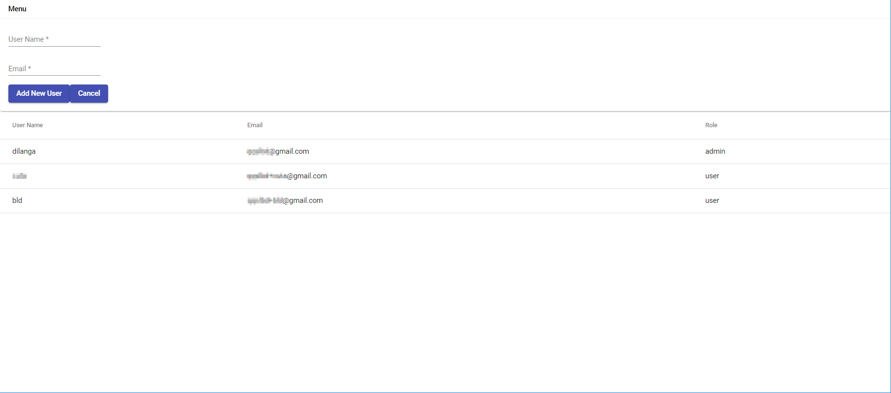
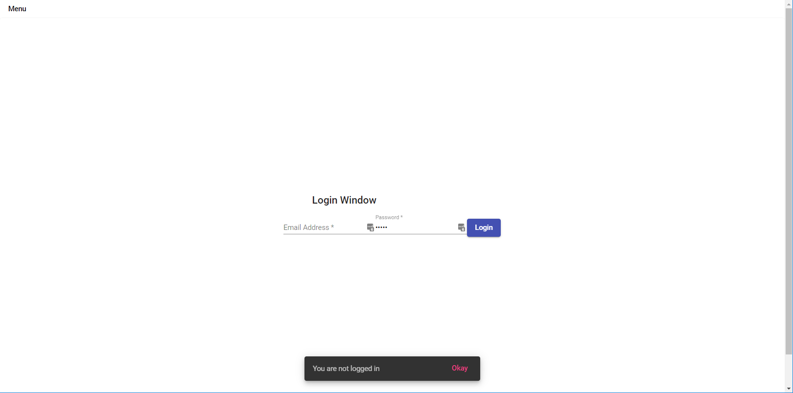
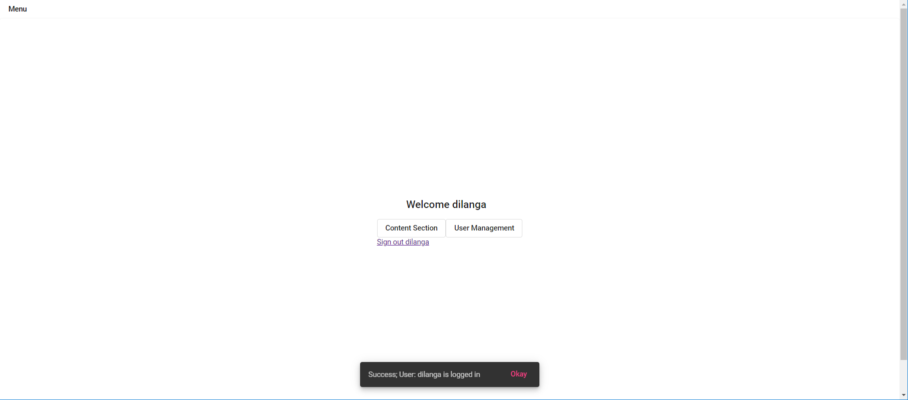
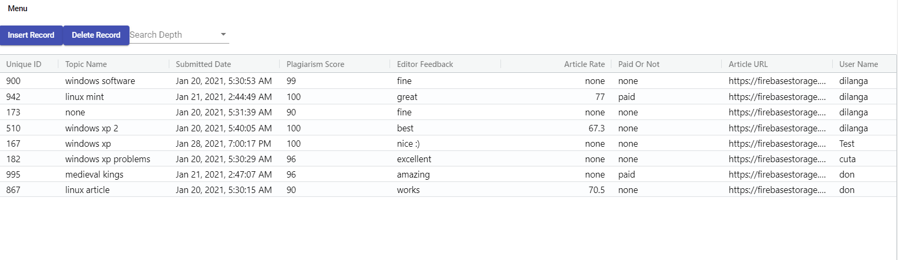

# Content Management System for Blog

"Content Management System for Blog (CMSB)" is an open source web application to manage content, and users of a blog. 

## Features

- Content management
- User management
- Plagiarism checking via Copyscape
- Payment tracking
- User Authentication via Firebase
- Content progress tracking

## Requirements 

- A firebase instance
- A web server (preferablly Nginx installed on a VPS)
- The [API](https://github.com/donqq/Content-Management-System-for-Blogs-API)
- Visual Studio Code

## How to Install

- Download the Angular application to your computer
- Open it via Visual Studio code
- Type npm install to install required packages in the package.json file
- Configure the Firebase instance
  - Create a Firebase instance
  - Add an admin to the "Authentication" section
  - Copy the Configuration JSON in Project Settings -> General -> Your aps -> Config, and Paste it in [Environment File](https://github.com/donqq/Content-Management-System-for-Blogs/blob/master/src/environments/environment.ts)
  - Configure the Firebase realtime database with information in this [file](https://github.com/donqq/Content-Management-System-for-Blogs/blob/master/Firebase%20Configuration.ts). Basically the database, and the rules of the database have to be configured properly. 
  - Change the MY_PROJECT_ID to your Firebase instance's Project Id name in [firebaserc file](https://github.com/donqq/Content-Management-System-for-Blogs/blob/master/.firebaserc)
- Download The [API](https://github.com/donqq/Content-Management-System-for-Blogs-API)
- Open it via Visual Studio Code
- Register in Copyscape, add $5 credits to the account, and go to the Premium API Section
- Copy the account's Username, and API Key, and add it to the [PlagiarismCheckingMeta](https://github.com/donqq/Content-Management-System-for-Blogs-API/blob/master/DataTransferObject/PlagiarismCheckingMeta.cs)
- Replace firebase_project_id in both AuthRepository.cs, Startup.cs files with the "firebase project id" you have created early.
- Run both the Projects. Angular project can be run with ng serve command, whereas the C# API can be run with dotnet watch run

## Developer
Badde Liyanage Don Dilanga, 2021/January, github@dilanga.com.
Sri Lanka LK. 

## License
Simple non code license (SNCL)

#### Can
 - Distribute
 - Modify
#### Cannot
 - Commercial Use
 - Hold Liable
 - Use Trademark
#### Must
 - Include Copyright
 - Include Notice
 - Include License
 - Give Credit

# Screenshots
   
